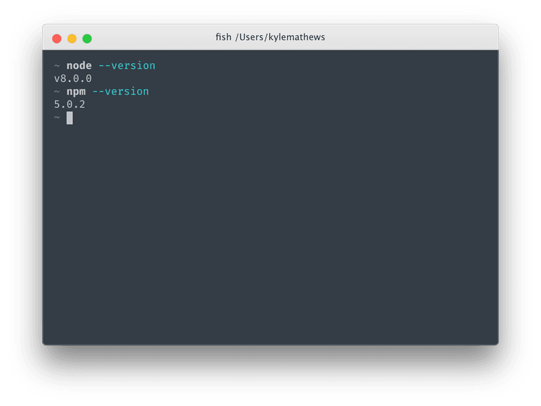

# Active Workspace Extentions Docs Starter

#### This Project was forked from [Gatsby Docs Starter](https://github.com/ericwindmill/gatsby-starter-docs)

# Getting started

## Check your development environment

Git - If you need to install Git [download from here](https://git-scm.com/). You can also download the [GitHub Desktop App](https://desktop.github.com/) for the point and click people. If you aren't sure... you should probably install it> If nothing else it can't hurt to get the newest version

Let's check first that you have everything set up to start creating with Gatsby.
You will need a recent version of Node.js installed.

Node.js is a programming tool for running JavaScript on servers and in your
computer's terminal. Gatsby is built using Node.js.

Open a terminal window. We are big fans of VS Code. It has a terminal built in! Check out [Visual Studio Code](https://code.visualstudio.com/). See
[terminal instructions for Mac users](http://www.macworld.co.uk/feature/mac-software/how-use-terminal-on-mac-3608274/) and
[terminal instructions for Windows users](https://www.quora.com/How-do-I-open-terminal-in-windows). In your terminal window, type `node --version` and hit ENTER, then `npm --version` and hit ENTER (tip: to run a specified command, you must type the command into your terminal and then press ENTER. Then the command will run).

You should see something like:



Gatsby supports versions of Node back to v6 and npm to v3.

If you don't have Node.js installed, go to https://nodejs.org/ and install the
recommended version for your operating system.

## Clone the Repo

If you are using the terminal, type the line below in the directory you want the site to live:

```
git clone https://github.com/ActiveWorkspaceExtensions/AW-Docs-Site.git
```
You can also clone the repo from the GitHub Desktop App.

Open the directory ```AW-Docs-Site``` in your terminal.

## Install Gatsby Dependancies

Unfortunatly we aren't talking about that great Leonardo DiCaprio movie. Gatsby is a static site generator used to convert easy to make [Markdown](https://www.markdownguide.org/getting-started) files into great looking web pages. First install Gatsby's command line program by running the following:

```sh
npm install --global gatsby-cli
```

Next we are going to get all the packages needed to run the site. Run:

```sh
nmp install
```

Grab a drink while you wait.

## Running locally

To build the site and start the local dev server type:

Gatsby has a built-in development server. Let's start it up by running the
following command:

```sh
gatsby develop
```

You should shortly see some text, close to the bottom, that says `The development server is listening at:` [http://localhost:8000](http://localhost:8000). Open that address in your
browser and...

Yeah! It's working!!!

Too cool 😎

Gatsby's development server is a "hot reloading" server, meaning any change you
make to your React.js page components (and later we'll learn, your data files)
will be immediately visible and/or loaded in the browser.

This is huge because it makes development so much faster and fun.

## Extra Commands

- You can chack the ```package.josn``` file for the scripts. 
- ```npm clean``` will clean out the public file and anything built.
- ```gatsby build``` will do a full production build of the site. There will be a ```public``` folder that is compressed and contains all of the static files. The contents of this folder is what the ```ActiveWorkspaceExtensions.github.io``` repo holds. Any changes need to be pushed to that folder from a fresh build.
- I have a script that will automatically do that, ```npm deploy```. The only issue is that it uses the current directory as the repo location.

## Markdown Help

Markdown is pretty cool, but there is a special way to get things styled the way you want it. Check out the [Markdown Guide](https://www.markdownguide.org/getting-started) to help you get started.
